# Local LLM Test Case Generator


A **Privacy-First** AI tool that generates comprehensive unit tests for your code using a local LLM (`llama3.2`) via Ollama. No data leaves your machine.

---

## 🏗️ Architecture

The system follows a strict **3-Layer Architecture** (Frontend, Backend, and AI) to ensure deterministic results from probabilistic models.

```mermaid
graph TD
    User([👤 Developer])
    
    subgraph "Frontend Layer (Web UI)"
        UI[💻 Single Page App]
        Highlight[Syntax Highlighter]
    end
    
    subgraph "Navigation Layer (Backend)"
        API[🚀 FastAPI Server]
        PromptEng[⚙️ Prompt Strategy]
        Cleaner[🧹 Code Sanitizer]
    end
    
    subgraph "Tool Layer (Local AI)"
        Ollama[🦙 Ollama API]
        Model[(llama3.2)]
    end

    User -->|Pastes Code| UI
    UI -->|POST /generate| API
    API -->|Construct Prompt| PromptEng
    PromptEng -->|Raw Request| Ollama
    Ollama -->|Inference| Model
    Model -->|Generated Token Stream| Ollama
    Ollama -->|Raw Response| Cleaner
    Cleaner -->|Clean Python Code| API
    API -->|JSON Response| UI
    UI -->|Render & Highlight| Highlight
    Highlight -->|Visual Output| User
```



---

## 🚀 Getting Started

### Prerequisites

1. **Ollama**: Installed and running (`ollama serve`).
2. **Model**: Pull the model: `ollama pull llama3.2`.
3. **Python 3.10+**: with `pip`.

### Installation

1. **Clone the repository**:

    ```bash
    git clone https://github.com/pratikkoli21-cloud/AITesterBluePrintProjects.git
    cd "Project 1 - LocalTestCaseGenerator"
    ```

2. **Install Backend Dependencies**:

    ```bash
    pip install -r backend/requirements.txt
    ```

### Usage

#### Option A: Web Interface (Recommended)

1. **Start the Backend**:

    ```bash
    python -m backend.main
    ```

2. **Open the Frontend**:
    Double-click `frontend/index.html` to open it in your browser.

#### Option B: CLI Tool

Run the PowerShell script directly on any file:

```powershell
.\TestGen.ps1 -File .\calculator.py
```

---

## 📂 Project Structure

- `backend/`: FastAPI server and Prompt Engineering logic.
- `frontend/`: Premium Dark-Mode UI (Single File).
- `tools/`: Utility scripts for deployment and verification.
- `architecture/`: Technical SOPs and System Design documents.
- `TestGen.ps1`: Standalone CLI wrapper.

---

## 🛡️ License

This project is licensed under the MIT License.
